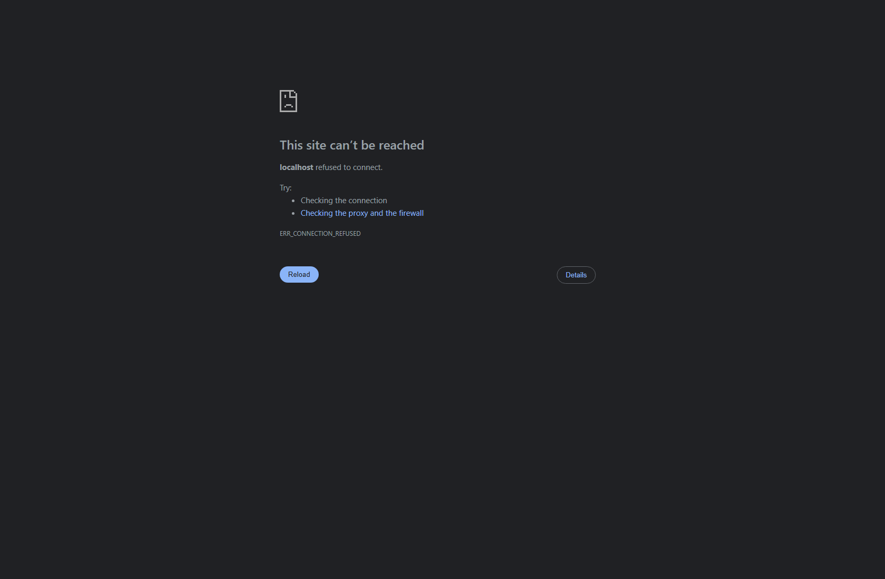
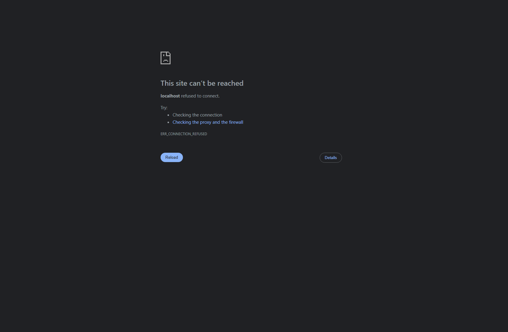
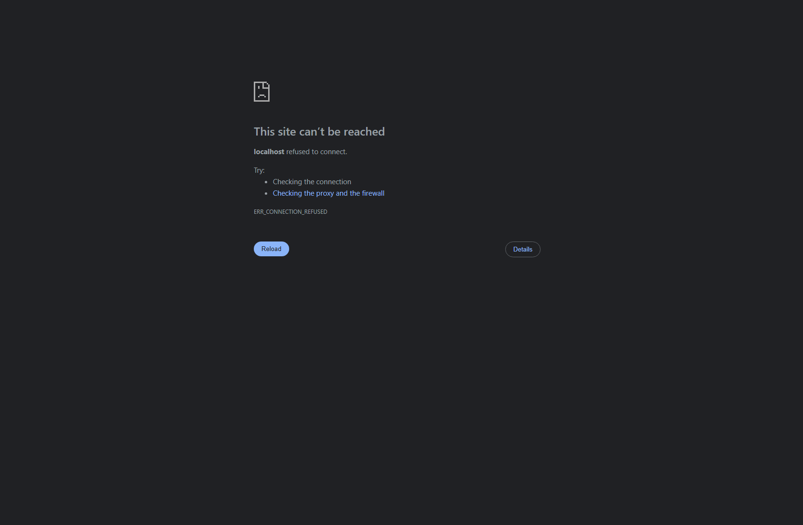
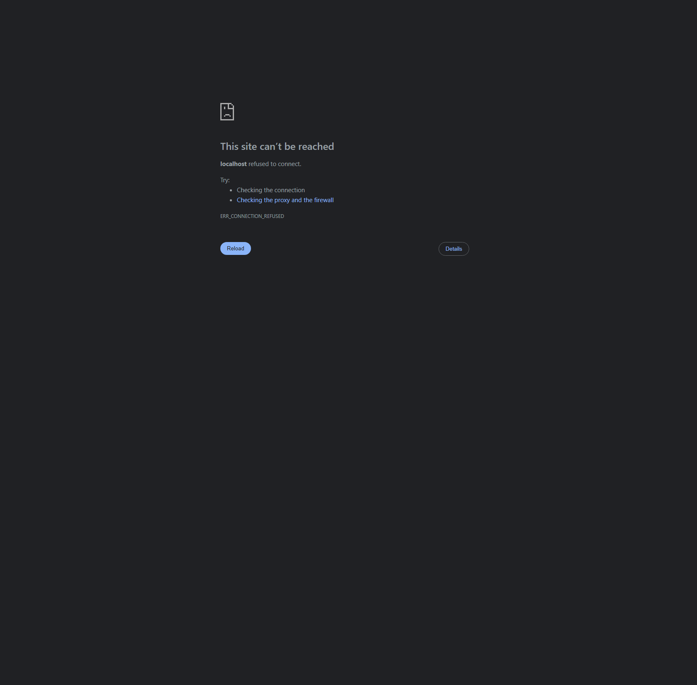
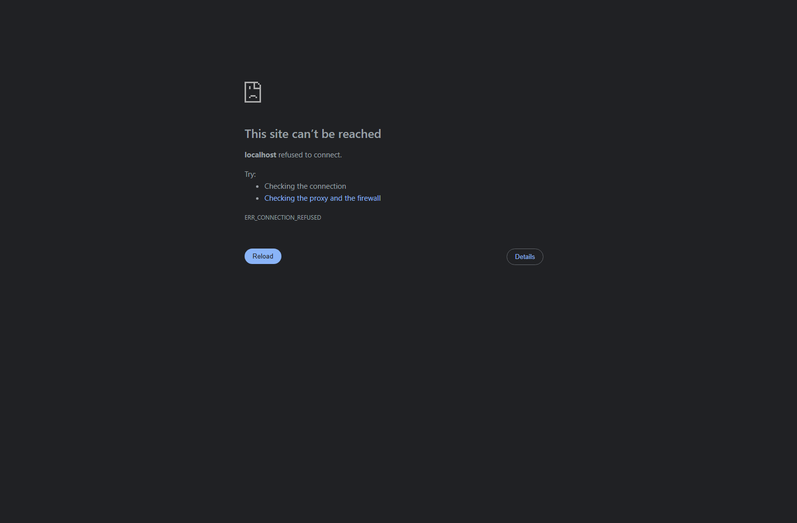
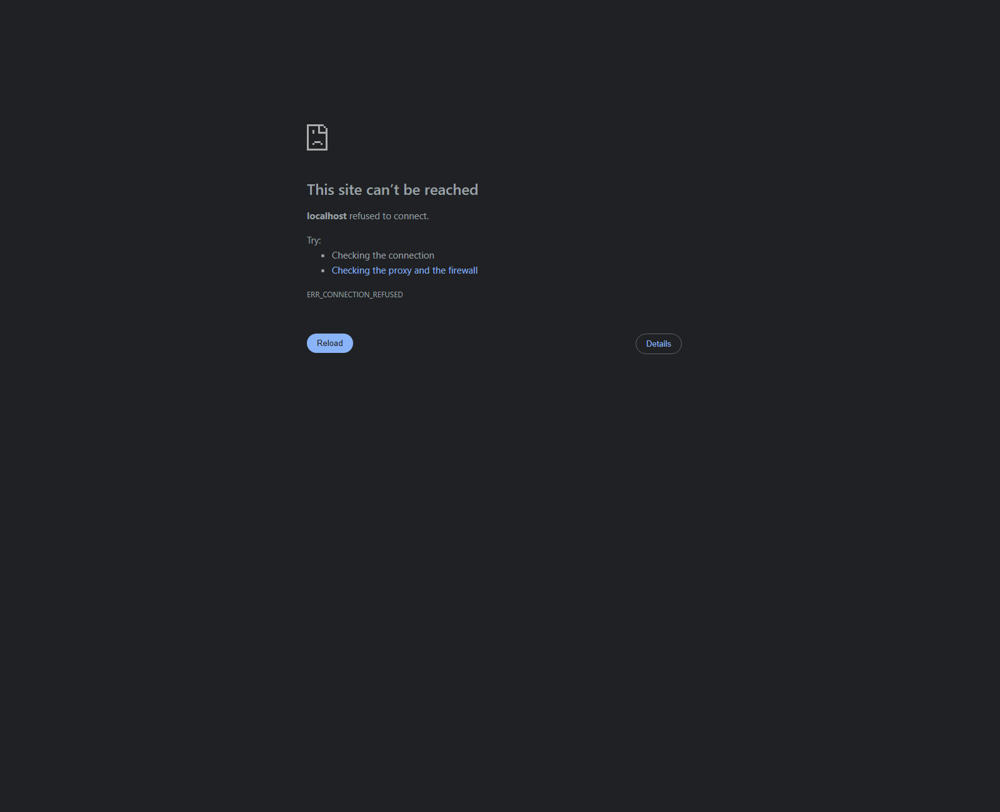
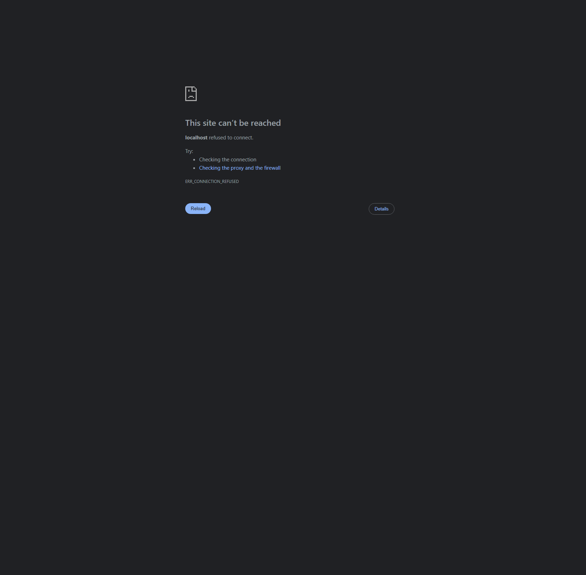
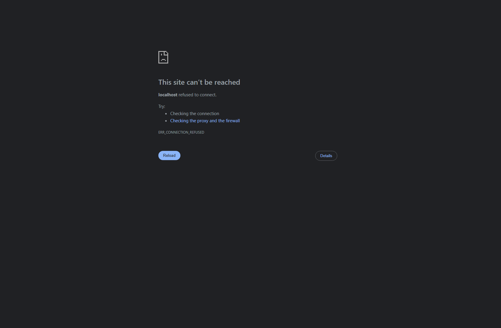

# PaceTracer 🏎️ — 2025 Formula 1 Telemetry & Circuit Replay Platform

[](https://github.com/Pushkar69RS/f1_timesheet/actions)
[](https://nodejs.org/)
[](https://reactjs.org/)
[](https://vitejs.dev/)
[](https://tailwindcss.com/)
[](https://www.docker.com/)
[](https://opensource.org/licenses/ISC)

> **PaceTracer** is a full-stack, broadcast-grade Formula 1 Telemetry & Race Replay platform capturing the **2025 FIA Formula 1 World Championship**. Built with **Node.js, Express, WebSockets, HTML5 Canvas, React 18, and Tailwind CSS**, it delivers 60 FPS track telemetry, authentic FIA circuit sector timing, live race control incident feeds, head-to-head driver telemetry comparisons, and instant Grand Prix simulation switching across all 24 rounds of the 2025 calendar.

---

## 📸 Feature Showcase Gallery

| **1. 2025 Telemetry Dashboard (Bahrain GP - Dark)** | **2. Broadcast Light Theme (Monaco GP)** |
| :---: | :---: |
|  |  |

| **3. Head-to-Head Telemetry Comparison Modal** | **4. Live Driver Hybrid Telemetry (#44 Hamilton)** |
| :---: | :---: |
|  |  |

| **5. 2025 Technical Specifications Showcase** | **6. Interactive 24-Round Calendar Grid** |
| :---: | :---: |
|  |  |

| **7. Official Race Classification & FIA Points** | **8. Suzuka Figure-8 Circuit Replay** |
| :---: | :---: |
|  |  |

---

## 🌟 Key Features

### 📡 Real-Time WebSocket Telemetry Engine (50ms Broadcast Ticks)
- **Event-Driven Timeline Synchronization**: Ingests and normalizes multi-endpoint timing data into a chronological high-frequency event stream.
- **Bi-Directional Playback Controls**: Scrub anywhere along the Grand Prix (0%–100%) with instant state reconstruction and variable playback speeds (**0.25x**, **0.5x**, **1.0x**, **2.0x**, **4.0x**).
- **Synchronized Lap Tracking**: Continuous leader-lap tracking ensures zero delay at lights out (starts on Lap 1 immediately) and reliable lap progress.

### 🗺️ Calibrated FIA Circuit Maps (Catmull-Rom Spline Ribbon)
- **Dense Spline Interpolation**: Pre-computes 300 parametric points per circuit, locking cars 100% to the racing line with realistic lateral overtaking offsets.
- **Official Sector Transponders**: Accurate Sector 1 (Cyan `#00D2BE`), Sector 2 (Amber `#FFB800`), and Sector 3 (Purple `#BF5AF2`) timing split lines.
- **Interactive Map Overlays**: Canvas toggles for **Official Turn Numbers** (e.g. *T1 Copse*, *T10 Maggotts*, *T15 Stowe*) and **DRS Activation Zones**.
- **Interactive Tooltip Cards**: Hover or click on any car marker to inspect real-time position, current tyre compound, and lap times.

### ⚔️ Head-to-Head Driver Telemetry Comparison
- Side-by-side comparison modal for any 2 drivers on the grid:
  - **1-Click Rivalry Presets**: *Hamilton vs Leclerc*, *Verstappen vs Norris*, *Russell vs Antonelli*, *Hülkenberg vs Bortoleto*.
  - **Pace Delta Analysis**: Real-time fastest lap delta indicator.
  - **Sector Delta Matrix**: Side-by-side S1, S2, S3 breakdown with green pace badges.
  - **2025 Power Units**: 120kW MGU-K Hybrid State of Charge (SoC %) and DRS wing states.

### 📻 Race Control Live Incident Feed & Weather Widget
- **Dynamic Incident Feed**: Real-time ticker logging fastest laps (🟣), pit stops (🟠), VSC/Safety Cars (🟡), and lead changes (👑).
- **Live Circuit Weather Radar**: Ambient and track temperature, rain risk %, wind speed, and weather condition badges.

### 🏎️ 2025 Grid & Official Driver Headshots
- Official Formula 1 media CDN portrait headshots for all 20 drivers.
- Complete 2025 constructor lineup:
  - **Scuderia Ferrari**: Lewis Hamilton #44 & Charles Leclerc #16
  - **McLaren**: Lando Norris #4 & Oscar Piastri #81
  - **Red Bull Racing**: Max Verstappen #1 & Liam Lawson #30
  - **Mercedes**: George Russell #63 & Kimi Antonelli #12
  - **Aston Martin**: Fernando Alonso #14 & Lance Stroll #18
  - **Williams**: Carlos Sainz #55 & Alexander Albon #23
  - **Stake F1 Team Kick Sauber**: Nico Hülkenberg #27 & Gabriel Bortoleto #5 (`#52E252` neon green)
  - **Alpine**: Pierre Gasly #10 & Jack Doohan #7
  - **Haas**: Esteban Ocon #31 & Oliver Bearman #87
  - **Visa Cash App RB**: Yuki Tsunoda #22 & Isack Hadjar #6

### 🏁 Official Race Classification & Championship Points
- Complete 20-driver race classification table awarding official FIA points (+25, +18, +15, +12, +10, +8, +6, +4, +2, +1).
- **Constructors Championship Standings Tab**: Live round total points computed dynamically from combined team results.

### 🌓 Full Light & Dark Theme Switcher
- **Cyber F1 Dark Mode**: High-contrast neon radar styling (`#07090E`, `#111622`).
- **Broadcast Light Mode**: Clean FIA timing tower aesthetic (`#F3F4F6`, `#FFFFFF`).

---

## 🏗️ Architecture

```
┌──────────────────────────────────────────────────────────────────┐
│                         REACT FRONTEND                           │
│  ┌───────────────────────┐             ┌──────────────────────┐  │
│  │   TimesheetTable      │             │    TrackMap Canvas   │  │
│  │ (Timing, Gaps, Tyres) │             │ (60 FPS Spline Lerp) │  │
│  └───────────▲───────────┘             └──────────▲───────────┘  │
│              │                                    │              │
│  ┌───────────┴────────────────────────────────────┴───────────┐  │
│  │            Dashboard.jsx (WebSocket Client)                │  │
│  │  - WeatherWidget    - RaceControlFeed   - CompareModal     │  │
│  └───────────────────────────────▲────────────────────────────┘  │
└──────────────────────────────────┼───────────────────────────────┘
                                   │  WebSocket Snapshot Stream (50ms)
                                   │  JSON Control Actions (Play/Seek)
┌──────────────────────────────────▼───────────────────────────────┐
│                        NODE.JS BACKEND                           │
│  ┌────────────────────────────────────────────────────────────┐  │
│  │           server.js (Express HTTP API + WS Server)         │  │
│  └───────────────────────────────▲────────────────────────────┘  │
│                                  │                               │
│  ┌───────────────────────────────┴────────────────────────────┐  │
│  │                      ReplayEngine.js                       │  │
│  │  - Event queue processing & timeline interpolation         │  │
│  │  - State snapshot manager & 2025 Grand Prix generator      │  │
│  └───────────▲────────────────────────────────────▲───────────┘  │
│              │                                    │              │
│  ┌───────────┴───────────┐             ┌──────────┴───────────┐  │
│  │      season2025.js    │             │    circuitData.js    │  │
│  │ (24-Round 2025 Data)  │             │ (FIA Track Geometry) │  │
│  └───────────────────────┘             └──────────────────────┘  │
└──────────────────────────────────────────────────────────────────┘
```

---

## 🚀 Getting Started

### Prerequisites
- **Node.js**: v18.0.0 or higher
- **npm**: v9.0.0 or higher

### Local Setup

1. **Clone the repository**:
   ```bash
   git clone https://github.com/Pushkar69RS/f1_timesheet.git
   cd f1_timesheet
   ```

2. **Install dependencies**:
   ```bash
   # Install Backend
   cd backend
   npm install

   # Install Frontend
   cd ../frontend
   npm install
   ```

3. **Start the application**:
   ```bash
   # Terminal 1: Start Backend (Port 3001)
   cd backend
   node src/server.js

   # Terminal 2: Start Frontend (Port 5173)
   cd frontend
   npm run dev
   ```

4. Open your browser and navigate to **[http://localhost:5173](http://localhost:5173)**.

---

## 🌐 Free Cloud Hosting & Deployment

### Option 1: 1-Click Deploy on Render.com (Recommended — Fullstack + WebSockets)
1. Sign up for free at **[Render.com](https://render.com)** and connect your GitHub account.
2. Click **New +** → **Web Service**.
3. Select your repository `https://github.com/Pushkar69RS/f1_timesheet`.
4. Configure the service:
   - **Environment**: `Node`
   - **Build Command**: `npm run build`
   - **Start Command**: `npm start`
   - **Plan**: `Free`
5. Click **Create Web Service**.

---

### Option 2: 1-Click Deploy on Railway.app
1. Go to **[Railway.app](https://railway.app)** and log in with GitHub.
2. Click **New Project** → **Deploy from GitHub repo** → select `f1_timesheet`.
3. Railway automatically detects `package.json`, runs `npm run build`, and exposes the live URL with full WebSocket support.

---

## 🧪 Testing & Verification

```bash
# Backend test suite (11 unit tests)
cd backend
npm test

# Frontend ESLint & production build
cd ../frontend
npm run lint
npm run build
```

---

## 🐳 Docker Deployment

Run the complete multi-container setup via Docker Compose:

```bash
docker-compose up --build
```
- Frontend: `http://localhost:5173`
- Backend API: `http://localhost:3001`

---

## 📄 License
ISC License &copy; 2025 PaceTracer.
